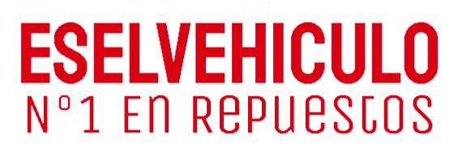

  

# ESELVEHICULO - Laravel

eselvehiculo es un proyecto de ventas de repuestos del sector automotriz realizado en laravel donde se puede cargar productos, definir, menu, crear usuarios entre otras funciones

## Instalacion

- npm i
- comporser require
- crear base de datos
- configurar archivos .env
- php aritsan serve

## Link del proyecto

- [eselvehiculo - site](http://eselvehiculo.com/)

### Contributing

- **[FRF-WEB](https://frfweb.netlify.app/)**

## License

The Laravel framework is open-sourced software licensed under the [MIT license](https://opensource.org/licenses/MIT).
